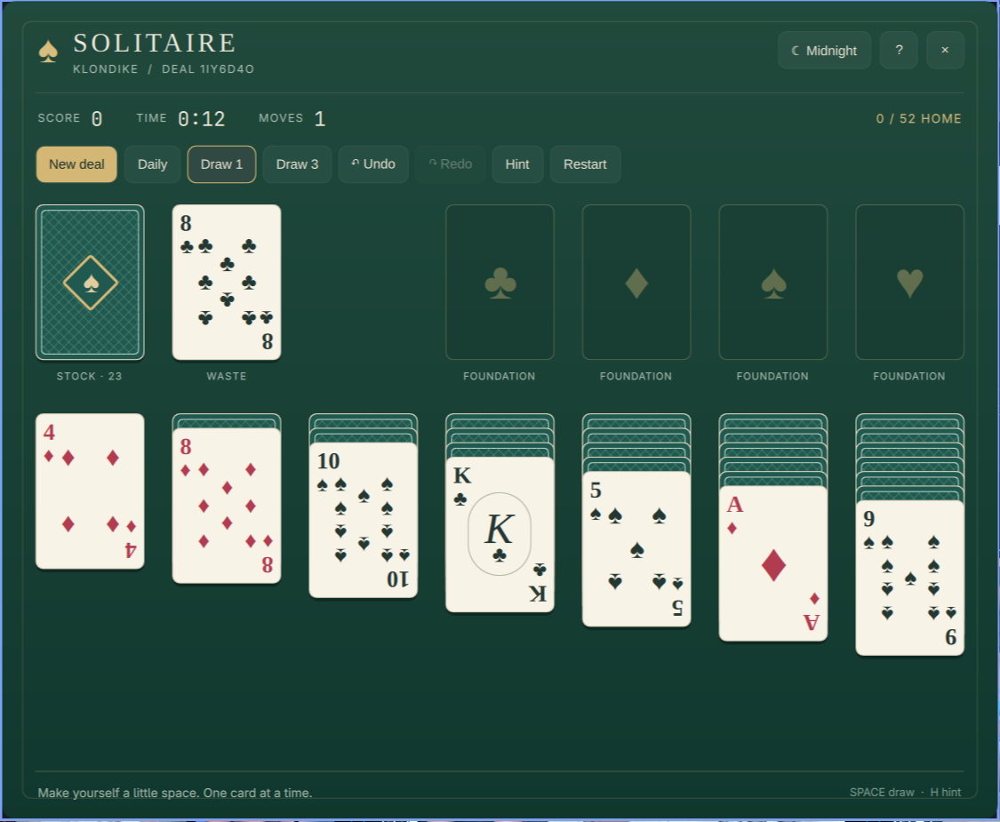

# Solitaire

An ivory-and-felt Klondike table for Omarchy, with a midnight theme when the
evening calls for it. Open the spade in your bar and pick up where you left off.



## Play

- Draw one or three cards; switch modes from the toolbar.
- Click a face-up card and its destination, or drag a card and its entire run.
- Double-click a top card to send it to its foundation.
- Build foundations from ace to king in suit. Build tableau columns down in
  alternating colors. Only kings can start empty columns.
- Hints highlight a source and destination and explain the move. They prioritize
  safely building foundations and uncovering hidden cards; they are suggestions,
  not a solver or a guarantee of winning.
- Undo and redo cover up to 500 moves. Restart repeats the exact same shuffle.
- Daily deals share a date-derived shuffle in draw-one mode. Random and daily
  shuffles are fair deals, not guaranteed solvable deals.
- Auto-finish appears once the stock and waste are empty and every tableau card
  is face up. The whole finish can be undone in one step.
- Games and statistics save automatically. Time pauses while the panel is closed.
  All monitors share the same game.

## Keyboard

| Key | Action |
| --- | --- |
| Space | Draw or recycle stock |
| H | Show a hint |
| U / Ctrl+Z | Undo |
| R / Ctrl+Shift+Z / Ctrl+Y | Redo |
| Arrows | Navigate cards and piles |
| Enter | Select or place |
| F | Send the selected card to its foundation |
| A | Auto-finish when available |
| N | New deal, with confirmation |
| D | Daily deal, with confirmation |
| Esc | Dismiss dialog, clear selection, or close |
| ? / F1 | Rules, keyboard shortcuts, and statistics |

## Scoring

+10 for a foundation card, +5 from waste to tableau, +5 for revealing a hidden
card, −15 for returning a foundation card, and −20 for recycling the stock.
The score never drops below zero. Wins count once per attempt, even after undo
and redo; a deal counts as played when you make its first move or stock draw.

## Install

```sh
omarchy plugin add https://github.com/grivera82/omarchy-solitaire --enable --yes
```

### Local development install

Copy this directory into `~/.config/omarchy/plugins/grivera.solitaire/`, then:

```sh
omarchy-shell shell rescanPlugins
omarchy plugin enable grivera.solitaire --section right
```

Open from your bar, or use `omarchy-shell grivera.solitaire toggle`.
Right-click the bar icon to open the guide and your statistics.

## Files and dependencies

Uses the Quickshell and Qt Quick APIs already shipped by Omarchy. The game engine
is JavaScript; the interface and card art are native QML. There are no downloads,
network requests, daemons, accounts, packages to install, or external assets.
Only `mkdir -p` is called to create the save directory.

Saves live in `$XDG_STATE_HOME/grivera-solitaire/game.json`, or
`~/.local/state/grivera-solitaire/game.json` when XDG_STATE_HOME is unset.
Writes are atomic. Invalid saved games are rejected, and a fresh deal is created.

Disable with `omarchy plugin disable grivera.solitaire`. Remove with
`omarchy plugin remove grivera.solitaire --yes`. Saves are retained; to erase
your game and record, remove only the `grivera-solitaire` directory at your
configured state location.

## Development

```sh
node --test tests/game.test.cjs
python tests/service-smoke.py
omarchy plugin validate .
```

Tests cover deterministic dealing, legality, draw-three order and recycling,
reveals, scoring, completion, corruption rejection, and card conservation across
random legal games. The service smoke check uses a separate Quickshell process
and a temporary state directory to test real saves, restoration, undo/redo,
win counts, and shared-clock ownership. Check the native panel after UI changes.

MIT license. Designed for Omarchy Quattro.
